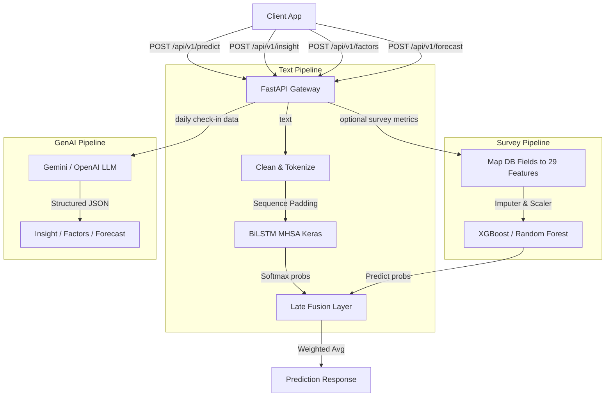

# MoodSense ML API

An inference-only FastAPI service that orchestrates two machine learning models and generative AI to provide comprehensive mental well-being analysis:

1. **Text-based Sentiment Analysis**: Powered by a custom **BiLSTM + Multi-Head Self-Attention** TensorFlow model classifying text into `stress`, `happy`, and `normal`.
2. **Survey-based Stress Prediction**: Powered by **XGBoost** and **Random Forest** classification models utilizing localized features to predict stress severity levels.
3. **GenAI-powered Insights**: Powered by **Gemini** or **OpenAI-compatible** LLMs to generate empathetic daily insights, extract stress/happiness factors, and forecast mood trends.

---

## Architecture Overview



---

## 📂 Project Structure

```
moodsense-ml-api/
├── app/
│   ├── __init__.py
│   ├── __main__.py          # Module entrypoint (uvicorn launcher)
│   ├── main.py              # FastAPI app factory & lifespan
│   ├── config.py            # Settings via pydantic-settings
│   ├── inference.py         # ML model loading & prediction logic
│   ├── routes.py            # API route definitions
│   ├── schemas.py           # Pydantic request/response models
│   ├── genai/
│   │   └── inference.py     # GenAI insight, factors & forecast logic
│   └── ml-models/
│       ├── sentiment-analysis/   # BiLSTM MHSA Keras model artifacts
│       └── mood-prediction/      # XGBoost & Random Forest model artifacts
├── tests/
│   └── test_main.py         # Pytest test suite
├── Dockerfile               # Production container (Railway-ready)
├── pyproject.toml            # Project metadata & dependencies
├── uv.lock                  # Locked dependency versions
└── .env                     # Environment variables (not committed)
```

---

## 🛠️ Installation & Setup

Ensure you have [uv](https://github.com/astral-sh/uv) or `pip` installed.

### 1. Requirements & Dependencies

> [!IMPORTANT]
> **Scikit-learn Compatibility**: The survey models were trained using `scikit-learn==1.6.1`. Installing newer versions (like `1.8.x`) will cause unpickling crashes during startup. Ensure you install exactly `scikit-learn==1.6.1`.

To install dependencies in your virtual environment:

```bash
uv pip install -r pyproject.toml
uv pip install scikit-learn==1.6.1 xgboost pandas joblib dill
```

### 2. Environment Variables

Create a `.env` file in the project root. Refer to the table below for available variables:

| Variable | Required | Default | Description |
| :--- | :---: | :--- | :--- |
| `LLM_PROVIDER` | No | `gemini` | LLM backend to use: `gemini` or `openai` |
| `LLM_API_KEY` | Yes* | — | API key for Gemini (required when `LLM_PROVIDER=gemini`) |
| `GEMINI_MODEL` | No | `gemini-3.5-flash` | Gemini model name |
| `OPENAI_API_KEY` | Yes* | — | API key for OpenAI-compatible provider (required when `LLM_PROVIDER=openai`) |
| `OPENAI_BASE_URL` | No | — | Custom base URL for OpenAI-compatible APIs (e.g., DeepSeek) |
| `OPENAI_MODEL` | No | `deepseek-v4-flash` | OpenAI-compatible model name |
| `HOST` | No | `0.0.0.0` | Server bind address |
| `PORT` | No | `8000` | Server port (auto-detected on Railway) |
| `SURVEY_MODEL_TYPE` | No | `xgb` | Survey model backend: `xgb` or `rf` |
| `LATE_FUSION_WEIGHT` | No | `0.5` | Text model weight in late fusion (`0.0`–`1.0`) |

*At least one LLM API key is required for the GenAI endpoints (`/insight`, `/factors`, `/forecast`).

### 3. Run the Development Server

Start the Uvicorn server on localhost:

```bash
.venv\Scripts\python.exe -m uvicorn app.main:app --host 127.0.0.1 --port 8000 --reload
```

Or via the module entrypoint:

```bash
python -m app
```

---

## 🚀 API Endpoints & Integration Guide

All prediction endpoints are prefixed under `/api/v1`.

### 1. Welcome

* **Endpoint**: `GET /`
* **Response**:

  ```json
  {
    "message": "Welcome to MoodSense ML-API!"
  }
  ```

### 2. Health Check

* **Endpoint**: `GET /health`
* **Response**:

  ```json
  {
    "status": "ok"
  }
  ```

---

### 3. Mood & Stress Prediction

* **Endpoint**: `POST /api/v1/predict`
* **Content-Type**: `application/json`

#### Option A: Text-Only (Fallback Mode)

For predicting mood solely from a text journal entry.

* **Request Payload**:

  ```json
  {
    "text": "aku sangat sedih dan muak dengan semua ini"
  }
  ```

* **Response Payload**:

  ```json
  {
    "predicted_mood": "stress",
    "confidence": 0.94898,
    "scores": [
      { "label": "stress", "score": 0.94898 },
      { "label": "happy", "score": 0.03014 },
      { "label": "normal", "score": 0.02087 }
    ]
  }
  ```

#### Option B: Late Fusion (Text + Survey Metrics)

Integrate physical log survey parameters for a highly robust, unified prediction.

* **Request Payload**:

  ```json
  {
    "text": "aku sangat sedih dan muak dengan semua ini",
    "sleep_hours": 4.5,
    "activity_level": "LOW",
    "how_you_feeling": "STRESS"
  }
  ```

* **Response Payload**:

  ```json
  {
    "predicted_mood": "stress",
    "confidence": 0.97293,
    "scores": [
      { "label": "stress", "score": 0.97293 },
      { "label": "happy", "score": 0.01578 },
      { "label": "normal", "score": 0.01128 }
    ]
  }
  ```

---

### 4. AI Insight

Generate an empathetic, personalized insight and actionable recommendations based on the user's daily check-in data.

* **Endpoint**: `POST /api/v1/insight`
* **Content-Type**: `application/json`

* **Request Payload**:

  ```json
  {
    "sleep_hours": 7.0,
    "activity_level": "moderate",
    "study_hours": 5.0,
    "social_score": 8,
    "how_you_feeling": "normal",
    "notes": "Belajar cukup melelahkan hari ini karena ada ujian besok."
  }
  ```

* **Response Payload**:

  ```json
  {
    "insight": "Hari ini kamu cukup produktif dengan belajar 5 jam dan tidur yang ideal. Wajar kalau terasa melelahkan menjelang ujian, tapi kamu sudah berusaha dengan baik!",
    "recommendations": [
      {
        "name": "Power Nap",
        "description": "Tidur siang singkat untuk memulihkan energi sebelum review materi.",
        "duration": "20 menit"
      },
      {
        "name": "Jalan Kaki Sore",
        "description": "Jalan kaki ringan untuk meredakan ketegangan dan menyegarkan pikiran.",
        "duration": "15 menit"
      }
    ]
  }
  ```

---

### 5. Stress & Happiness Factors

Extract and classify daily check-in metrics into stress factors (stressors) and happiness factors (boosters).

* **Endpoint**: `POST /api/v1/factors`
* **Content-Type**: `application/json`

* **Request Payload**:

  ```json
  {
    "sleep_hours": 4.0,
    "activity_level": "none",
    "study_hours": 8.0,
    "social_score": 2,
    "how_you_feeling": "stress",
    "notes": "Belajar terus buat ujian besok, capek banget."
  }
  ```

* **Response Payload**:

  ```json
  {
    "stressors": [
      {
        "name": "Tidur",
        "value": "4.0 jam",
        "description": "Durasi tidur jauh di bawah ideal, meningkatkan risiko kelelahan dan stres."
      },
      {
        "name": "Belajar",
        "value": "8.0 jam",
        "description": "Belajar terlalu intens tanpa istirahat cukup dapat memicu burnout."
      }
    ],
    "boosters": [
      {
        "name": "Sosialisasi",
        "value": "2/10",
        "description": "Skor rendah — interaksi sosial bisa membantu meredakan tekanan."
      }
    ]
  }
  ```

---

### 6. Mood Forecast

Project the user's mood for the next 5 days based on historical trend data and daily metrics.

* **Endpoint**: `POST /api/v1/forecast`
* **Content-Type**: `application/json`

* **Request Payload**:

  ```json
  {
    "weekly_trend": [
      { "date": "2026-05-30", "average_mood": 6.5 },
      { "date": "2026-05-31", "average_mood": 5.8 },
      { "date": "2026-06-01", "average_mood": 5.2 },
      { "date": "2026-06-02", "average_mood": 4.9 },
      { "date": "2026-06-03", "average_mood": 5.5 },
      { "date": "2026-06-04", "average_mood": 6.0 },
      { "date": "2026-06-05", "average_mood": 6.3 }
    ],
    "average_mood": 5.7,
    "sleep_quality": 6.0,
    "check_in_streak": 7,
    "latest_mood": "NORMAL"
  }
  ```

* **Response Payload**:

  ```json
  {
    "forecasts": [
      { "day": "Besok", "date": "2026-06-06", "predicted_mood": 6.5, "label": "Biasa", "confidence": 0.82 },
      { "day": "Lusa", "date": "2026-06-07", "predicted_mood": 6.7, "label": "Baik", "confidence": 0.75 },
      { "day": "3 Hari Lagi", "date": "2026-06-08", "predicted_mood": 6.8, "label": "Baik", "confidence": 0.65 },
      { "day": "4 Hari Lagi", "date": "2026-06-09", "predicted_mood": 6.9, "label": "Baik", "confidence": 0.55 },
      { "day": "5 Hari Lagi", "date": "2026-06-10", "predicted_mood": 7.0, "label": "Baik", "confidence": 0.48 }
    ],
    "trend_direction": "meningkat",
    "trend_analysis": "Mood kamu sempat turun di awal minggu, tapi mulai naik kembali sejak 3 hari terakhir. Tren ini menunjukkan pemulihan yang positif.",
    "prevention_tips": [],
    "boost_tips": [
      "Pertahankan pola tidur 7+ jam untuk menjaga momentum positif.",
      "Lanjutkan aktivitas sosial yang kamu lakukan beberapa hari terakhir."
    ]
  }
  ```

---

## 📊 Database & Schema Field Mappings

The backend Prisma model fields from `mood_logs` map to the ML API inputs as follows:

### Prediction Endpoint

| Database Prisma Field | ML Request Field | Expected Format / Mappings |
| :--- | :--- | :--- |
| `notes` | `text` | String (journal/diary entry) |
| `sleep_hours` | `sleep_hours` | Float (represented as hours of sleep) |
| `activity_level` | `activity_level` | String Enum: `NONE`, `LOW`, `MODERATE`, `HIGH` |
| `how_you_feeling` | `how_you_feeling` | String Enum: `VERY_HAPPY`, `HAPPY`, `NORMAL`, `STRESS`, `VERY_STRESS` |

### Insight & Factors Endpoints

| Database Prisma Field | ML Request Field | Expected Format / Mappings |
| :--- | :--- | :--- |
| `sleep_hours` | `sleep_hours` | Float (`0.0`–`24.0`) |
| `activity_level` | `activity_level` | String Enum: `NONE`, `LOW`, `MODERATE`, `HIGH` |
| `study_hours` | `study_hours` | Float (`0.0`–`24.0`) |
| `social_score` | `social_score` | Integer (`0`–`10`) |
| `how_you_feeling` | `how_you_feeling` | String Enum: `VERY_HAPPY`, `HAPPY`, `NORMAL`, `STRESS`, `VERY_STRESS` |
| `notes` | `notes` | String (optional additional context) |

---

## ⚙️ Configuration Parameter Guide

Customize model behaviors inside `app/config.py` or through your `.env` file:

* `SURVEY_MODEL_TYPE`: Set to `"xgb"` (default) or `"rf"` to select the backing survey model.
* `LATE_FUSION_WEIGHT`: Set between `0.0` and `1.0` (default: `0.5`).
  * A value of `1.0` relies **entirely** on the text model.
  * A value of `0.0` relies **entirely** on the survey model.
  * A value of `0.5` averages both model probabilities equally.
* `LLM_PROVIDER`: Set to `"gemini"` (default) or `"openai"` to choose the GenAI backend.
* `GEMINI_MODEL`: Gemini model name (default: `gemini-3.5-flash`).
* `OPENAI_MODEL`: OpenAI-compatible model name (default: `deepseek-v4-flash`).

---

## 🧪 Testing

Run the test suite with pytest:

```bash
pytest tests/ -v
```

Tests include:
* Health check endpoint validation
* Prediction endpoint with and without model loading (503 fallback)
* Stubbed prediction service via FastAPI dependency overrides
* Mocked GenAI insight and factors endpoints

---

## 🐳 Railway Deployment

This repository is ready to deploy on Railway with the included `Dockerfile`.

1. Create a new Railway service from this GitHub repository.
2. Let Railway use the Dockerfile build.
3. Deploy with the default runtime settings. The app reads Railway's `PORT` variable and binds to `0.0.0.0` automatically.
4. Set the following environment variables in Railway:
   * `LLM_API_KEY` — your Gemini API key (or `OPENAI_API_KEY` if using the OpenAI provider).
   * `LLM_PROVIDER` — set to `gemini` or `openai` as needed.
5. Keep the bundled model artifacts in the image. If you move them later, override `MODEL_PATH`, `TOKENIZER_PATH`, `SCALER_PATH`, `IMPUTER_PATH`, `XGB_MODEL_PATH`, or `RF_MODEL_PATH` in Railway variables.
6. Use `/health` as the health check path.

> [!NOTE]
> Because the serialized survey models depend on `scikit-learn==1.6.1` and `xgboost==3.2.0`, those packages are pinned in `pyproject.toml` so the Railway build installs the same versions used locally.

---

## 📄 License

This project is licensed under the [MIT License](LICENSE).
