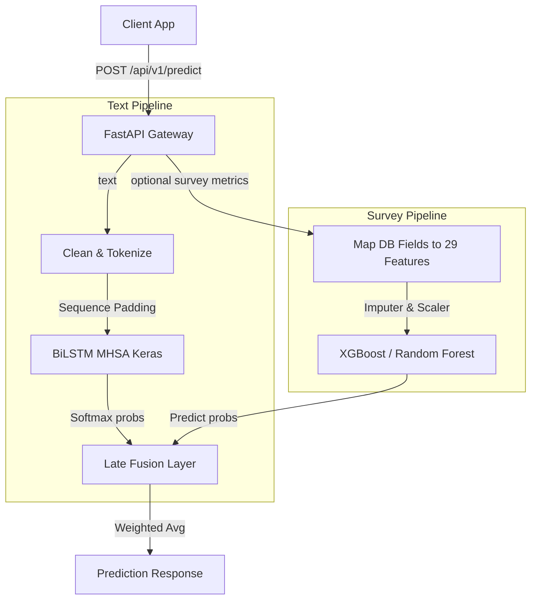

# MoodSense ML API

An inference-only FastAPI service that orchestrates two machine learning models using a late fusion decision framework:

1. **Text-based Sentiment Analysis**: Powered by a custom **BiLSTM + Multi-Head Self-Attention** TensorFlow model classifying text into `stress`, `happy`, and `normal`.
2. **Survey-based Stress Prediction**: Powered by **XGBoost** and **Random Forest** classification models utilizing localized features to predict stress severity levels.

---

## Architecture Overview



---

## 🛠️ Installation & Setup

Ensure you have [uv](https://github.com/astral-sh/uv) or `pip` installed.

### 1. Requirements & Dependencies
>
> [!IMPORTANT]
> **Scikit-learn Compatibility**: The survey models were trained using `scikit-learn==1.6.1`. Installing newer versions (like `1.8.x`) will cause unpickling crashes during startup. Ensure you install exactly `scikit-learn==1.6.1`.

To install dependencies in your virtual environment:

```bash
uv pip install -r pyproject.toml
uv pip install scikit-learn==1.6.1 xgboost pandas joblib dill
```

### 2. Run the Development Server

Start the Uvicorn server on localhost:

```bash
.venv\Scripts\python.exe -m uvicorn app.main:app --host 127.0.0.1 --port 8000 --reload
```

---

## 🚀 API Endpoints & Integration Guide

### 1. Health Check

* **Endpoint**: `GET /health`
* **Response**:

  ```json
  {
    "status": "ok"
  }
  ```

### 2. Mood & Stress Prediction

* **Endpoint**: `POST /api/v1/predict`
* **Content-Type**: `application/json`

#### Option A: Text-Only (Fallback Mode)

For predicting mood solely from a text journal entry.

* **Request Payload**:

  ```json
  {
    "text": "aku sangat sedih dan muak dengan semua ini"
  }
  ```

* **Response Payload**:

  ```json
  {
    "predicted_mood": "stress",
    "confidence": 0.94898,
    "scores": [
      { "label": "stress", "score": 0.94898 },
      { "label": "happy", "score": 0.03014 },
      { "label": "normal", "score": 0.02087 }
    ]
  }
  ```

#### Option B: Late Fusion (Text + Survey Metrics)

Integrate physical log survey parameters for a highly robust, unified prediction.

* **Request Payload**:

  ```json
  {
    "text": "aku sangat sedih dan muak dengan semua ini",
    "sleep_hours": 4.5,
    "activity_level": "LOW",
    "how_you_feeling": "STRESS"
  }
  ```

* **Response Payload**:

  ```json
  {
    "predicted_mood": "stress",
    "confidence": 0.97293,
    "scores": [
      { "label": "stress", "score": 0.97293 },
      { "label": "happy", "score": 0.01578 },
      { "label": "normal", "score": 0.01128 }
    ]
  }
  ```

---

## 📊 Database & Schema Field Mappings

The backend Prisma model fields from `mood_logs` map to the ML API inputs as follows:

| Database Prisma Field | ML Request Field | Expected Format / Mappings |
| :--- | :--- | :--- |
| `notes` | `text` | String (journal/diary entry) |
| `sleep_hours` | `sleep_hours` | Float (represented as hours of sleep) |
| `activity_level` | `activity_level` | String Enum: `NONE`, `LOW`, `MODERATE`, `HIGH` |
| `how_you_feeling` | `how_you_feeling` | String Enum: `VERY_HAPPY`, `HAPPY`, `NORMAL`, `STRESS`, `VERY_STRESS` |

---

## ⚙️ Configuration Parameter Guide

Customize model behaviors inside `app/config.py` or through your `.env` file:

* `SURVEY_MODEL_TYPE`: Set to `"xgb"` (default) or `"rf"` to select the backing survey model.
* `LATE_FUSION_WEIGHT`: Set between `0.0` and `1.0` (default: `0.5`).
  * A value of `1.0` relies **entirely** on the text model.
  * A value of `0.0` relies **entirely** on the survey model.
  * A value of `0.5` averages both model probabilities equally.

---

## Railway Deployment

This repository is ready to deploy on Railway with the included `Dockerfile`.

1. Create a new Railway service from this GitHub repository.
2. Let Railway use the Dockerfile build.
3. Deploy with the default runtime settings. The app now reads Railway's `PORT` variable and binds to `0.0.0.0` automatically.
4. Keep the bundled model artifacts in the image. If you move them later, override `MODEL_PATH`, `TOKENIZER_PATH`, `SCALER_PATH`, `IMPUTER_PATH`, `XGB_MODEL_PATH`, or `RF_MODEL_PATH` in Railway variables.
5. Use `/health` as the health check path.

Because the serialized survey models depend on `scikit-learn==1.6.1` and `xgboost==3.2.0`, those packages are now declared in `pyproject.toml` so the Railway build installs the same versions used locally.
